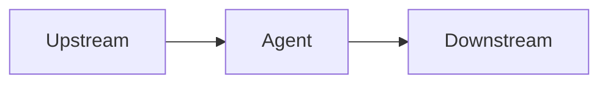

# Data Flow

## Summary
<Describe where inputs come from, what is sent to the LLM, and where outputs go.>

## Data classification
- <PII/sensitive/other>

## Mermaid diagram

```mermaid
flowchart LR
  A[Upstream] --> B[Agent]
  B --> C[Downstream]
```
