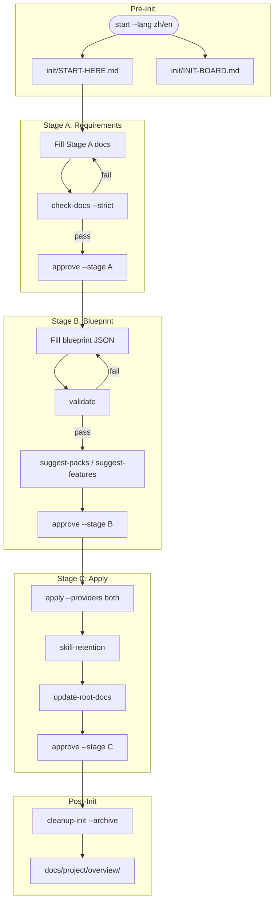

# Init kit (robust 3-stage pipeline)

> Human-facing documentation. If you are an LLM/AI assistant, skip this file and follow `init/AGENTS.md` instead.

The `init/` package provides a 3-stage, checkpointed workflow to bootstrap a repository from requirements:

- **Stage A**: Requirements docs → `init/_work/stage-a-docs/`
- **Stage B**: Blueprint → `init/_work/project-blueprint.json`
- **Stage C**: Scaffold + configs + skill packs + features + wrapper sync

---

## Flow overview



---

## Entry points

| File | Purpose | Edit? |
|------|---------|-------|
| `init/START-HERE.md` | Human/LLM entry + running log | Yes (LLM-maintained) |
| `init/INIT-BOARD.md` | Auto-generated status board | No |
| `init/_work/AGENTS.md` | Workdir rules + SSOT guidance | Reference |

---

## Quick start

```bash
# 1. Initialize (choose zh or en)
node init/_tools/skills/initialize-project-from-requirements/scripts/init-pipeline.mjs start --repo-root . --lang <zh|en>

# 2. Check progress
node init/_tools/skills/initialize-project-from-requirements/scripts/init-pipeline.mjs status --repo-root .

# 3. See next actions
node init/_tools/skills/initialize-project-from-requirements/scripts/init-pipeline.mjs advance --repo-root .
```

After `start`, open `init/START-HERE.md` (your entry) and `init/INIT-BOARD.md` (auto status).

---

## Stage flow summary

| Stage | Action | Validate | Approve |
|-------|--------|----------|---------|
| A | Fill Stage A docs | `check-docs --strict` | `approve --stage A` |
| B | Fill blueprint | `validate` | `approve --stage B` |
| C | Run apply | `apply --providers both` | `approve --stage C` |

For detailed stage instructions, see `init/_tools/skills/initialize-project-from-requirements/SKILL.md`.

---

## Key principles

- **Do not skip stages**: complete A → B → C in order
- **Explicit approval**: every stage transition requires user confirmation
- **Validation gates**: each stage has a validation step before approval

---

## Blueprint overview

Schema: `init/_tools/skills/initialize-project-from-requirements/templates/project-blueprint.schema.json`

| Section | Purpose |
|---------|---------|
| `project.*` | Name, description |
| `repo.*` | Language, package manager, layout |
| `capabilities.*` | Frontend, backend, database, API |
| `db.ssot` | Database SSOT mode: `none` / `repo-prisma` / `database` |
| `features.*` | Optional features to enable in Stage C |

---

## Optional features

For feature details and configuration, see:
- `init/_tools/feature-docs/README.md` (feature overview)
- `init/_tools/feature-docs/*.md` (per-feature docs)

---

## Post-init options

```bash
# Remove init/ (no archive)
node init/_tools/skills/initialize-project-from-requirements/scripts/init-pipeline.mjs cleanup-init --repo-root . --apply --i-understand

# Archive to docs/project/overview/ + remove init/
node init/_tools/skills/initialize-project-from-requirements/scripts/init-pipeline.mjs cleanup-init --repo-root . --apply --i-understand --archive
```

---

## More information

- LLM guidance: `init/AGENTS.md`
- Command reference: `init/_tools/skills/initialize-project-from-requirements/SKILL.md`
- Detailed reference: `init/_tools/skills/initialize-project-from-requirements/reference.md`
